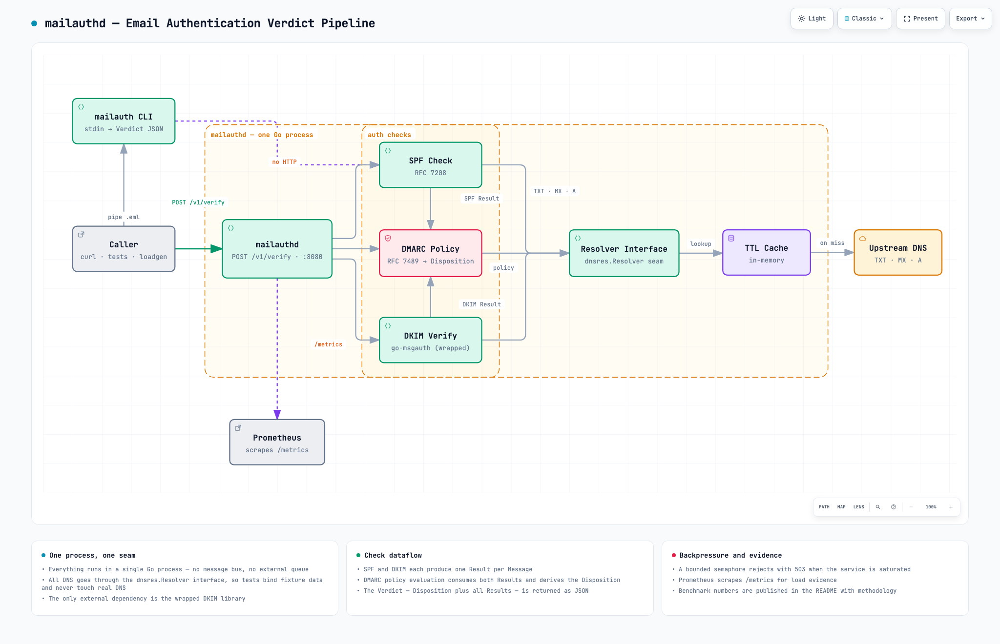

# mailauthd

A Go service that answers one question about any email: **can this sender be
trusted?** Submit a raw RFC 5322 message, get back a verdict — SPF, DKIM, and
DMARC results with a final DMARC-derived disposition.



## Reset notice

The first iteration of this repo was implemented by an AI agent — that history
is preserved below this commit, and in the `spf-tracer/*` branches (merged as
PRs #2–#4). On 2025-09-08 the code was stripped back to this baseline: the
project is now being built by hand, RFC by RFC, as a deliberate exercise in
reading specifications and turning them into correct, tested software.

## Domain vocabulary

**Check**, **Result**, **Disposition**, **Verdict** — defined in
[CONTEXT.md](CONTEXT.md). The glossary outlived the reset.

## MVP scope

The semantic core, nothing else:

- **SPF** (RFC 7208) — full evaluation: record parsing, all mechanisms,
  modifiers, macros, DNS processing limits. Conformance-tested against the
  open-spf.org RFC 7208 suite; fuzz targets on every parser.
- **DMARC** (RFC 7489) — policy discovery, alignment, disposition.
  Hand-written.
- **DKIM** (RFC 6376) — verification wrapped around `go-msgauth`. Crypto
  correctness isn't the showcase; orchestration is.
- **CLI** — `mailauth --ip 1.2.3.4 --mail-from bob@example.com < message.eml`,
  Verdict JSON on stdout. The engine's proof.
- **HTTP** — `POST /v1/verify`, same Verdict JSON. Last, and thin.

Deliberately out (yagni): load generator, `/metrics`, benchmark tables,
Docker, webhook/IMAP intake.

A raw message alone doesn't carry the connecting IP that `check_host()` needs
(RFC 7208 §2.4), so the caller supplies the SPF identity explicitly. Parsing
`Received:` headers to guess it is explicitly out of scope.

## Build order

1. bootstrap — module, layout, minimal CI
2. `dnsres` — resolver seam + fake resolver (no real DNS in tests, ever)
3. `verdict` — domain types
4. `spf` record parser (+ fuzz target)
5. `spf` check_host core — all/ip4/ip6/a, qualifiers, default results
6. `spf` DNS mechanisms + §4.6.4 processing limits + include/redirect
7. `spf` macros → full open-spf suite green
8. CLI end-to-end
9. `dmarc` — discovery, alignment, disposition
10. `dkim` — wrap go-msgauth
11. HTTP service

## API (planned)

```http
POST /v1/verify?ip=1.2.3.4&mail_from=bob@example.com
Content-Type: message/rfc822

<raw message bytes>
```

```json
{
  "disposition": "pass",
  "results": [
    {"check": "spf",   "outcome": "pass", "reason": "..."},
    {"check": "dkim",  "outcome": "pass", "reason": "..."},
    {"check": "dmarc", "outcome": "pass", "reason": "..."}
  ]
}
```

## Development

- Table-driven tests derived from RFC prose — one row per case, named after
  the RFC section or edge case it covers.
- Fuzz targets on all parsers; conformance suites run in full, never
  hand-picked.
- DNS always behind the `dnsres.Resolver` interface; no production code
  performs real DNS I/O in tests.
- Stdlib first.

## License

MIT.
